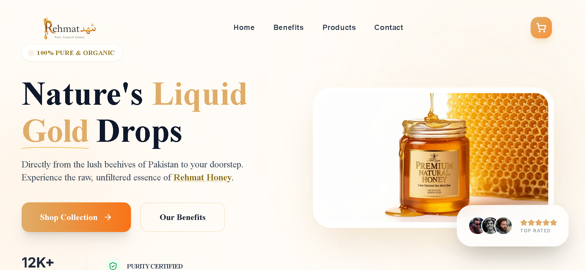
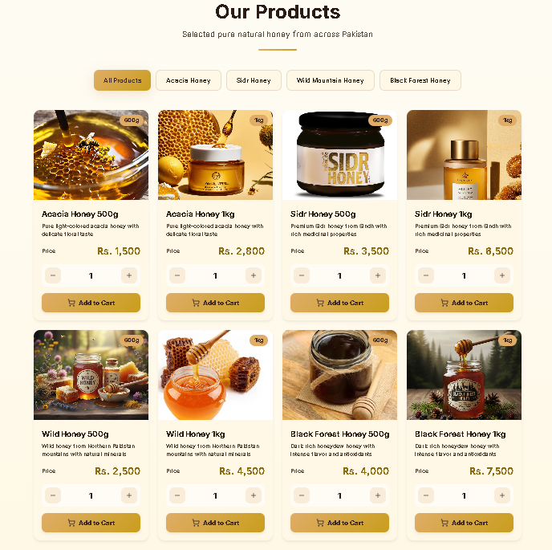
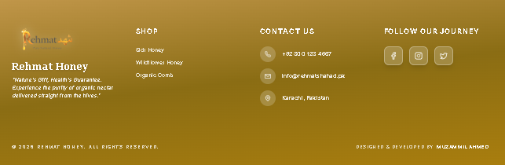

# 🍯 Rehmat Honey - Premium Natural Honey Landing Page

[](https://rehmathoney.netlify.app)
[](https://opensource.org/licenses/MIT)
[](https://reactjs.org/)
[](https://www.typescriptlang.org/)

> **A premium, culturally-rich landing page for natural honey products with Islamic values and modern design aesthetics.**

---

## 🚀 Live Demo
Check out the live website here: **[https://rehmathoney.netlify.app](https://rehmathoney.netlify.app)**

---

## 📸 Website Screenshots

### 🏠 Hero Section

*Premium landing page with elegant typography and honey-themed design*

### 📖 Quran & Hadith Section

*Islamic references with beautiful Arabic calligraphy and Urdu translations*

### 🍯 Products Showcase

*Premium honey varieties with custom images and interactive pricing*

### 🌟 Footer Design

*Golden honey-themed footer with contact information and social links*

---

## 🛠️ Development Workflow & Strategy

This project follows a modern **AI-Augmented Development** workflow:

* **Speed & Efficiency:** Used the **Lovable AI Web Builder** to rapidly prototype the UI structure, allowing me to focus more on logic and optimization.
* **Prompt & Context Engineering:** Applied advanced prompt engineering to ensure the design language reflects "Nature" and "Luxury." I provided deep context regarding the brand identity to get a tailored component architecture.
* **Manual Optimization & Refinement:** * Cleaned up the generated TypeScript code for better maintainability.
    * Optimized **Tailwind CSS** classes for pixel-perfect responsiveness across mobile and desktop.
    * Fine-tuned the asset delivery and form validation logic.

---

## ✨ Key Features

### 🎨 **Design & UI/UX**
- **Premium Visual Identity** - Golden honey theme with elegant typography
- **Mobile-First Responsive** - Optimized for all devices with superior mobile experience
- **Islamic Cultural Integration** - Bismillah symbol and Quranic references for trust building
- **Smooth Animations** - Engaging user interactions and transitions

### 🛒 **E-commerce Functionality**
- **Interactive Product Catalog** - Multiple honey varieties (Sidr, Acacia, Wild, Black Forest)
- **Working Cart System** - Add to cart with quantity management
- **Order Management** - Seamless ordering process with contact integration
- **Custom Product Images** - Unique visuals for each honey variant

### 🌐 **Technical Excellence**
- **TypeScript Implementation** - Type-safe development with better maintainability
- **Tailwind CSS** - Utility-first styling for rapid development
- **Vite Build System** - Fast development and optimized production builds
- **SEO Optimized** - Proper meta tags and social media integration

### 📱 **User Experience**
- **Intuitive Navigation** - Clean header with cart functionality
- **Trust Signals** - Customer testimonials and Islamic references
- **FAQ Section** - Comprehensive answers to common questions
- **Contact Integration** - Direct communication channels

---

## 🚀 Future Enhancements

- [ ] **Payment Integration** - Stripe/PayPal gateway for direct purchases
- [ ] **Order Tracking** - Real-time delivery status updates
- [ ] **User Accounts** - Customer registration and order history
- [ ] **Inventory Management** - Stock tracking and availability updates
- [ ] **Multi-language Support** - Full Arabic and Urdu translations
- [ ] **Admin Dashboard** - Content management system
- [ ] **Blog Section** - Educational content about honey benefits
- [ ] **Mobile App** - React Native companion app

---

## 🛠️ Development Approach

This project showcases modern **AI-Augmented Development** practices:

### 🤖 **AI-Powered Development**
- **Rapid Prototyping** - Leveraged AI tools for initial structure and component generation
- **Smart Code Generation** - Used AI assistance for TypeScript interfaces and component logic
- **Design Optimization** - AI-guided responsive design improvements

### 🎯 **Manual Refinement**
- **Code Quality** - Hand-optimized TypeScript for better maintainability
- **Performance** - Custom Tailwind CSS optimizations for faster loading
- **User Experience** - Manual fine-tuning of animations and interactions
- **Cultural Sensitivity** - Careful integration of Islamic elements and Arabic typography

---

## 👨‍💻 Developer

**Muzammil Ahmed**
- 🌐 **Portfolio:** [Coming Soon]
- 💼 **LinkedIn:** [Muzammil Ahmed](https://www.linkedin.com/in/muzammil-ahmed-0902612a5/)
- 🐙 **GitHub:** [@MuzammilBaloch-22](https://github.com/MuzammilBaloch-22)
- 📧 **Email:** [Contact via LinkedIn]

---

## 📄 License

This project is licensed under the MIT License - see the [LICENSE](LICENSE) file for details.

---

## 🙏 Acknowledgments

- **Islamic Calligraphy** - Beautiful Arabic typography integration
- **Honey Industry** - Inspiration from premium honey brands
- **Open Source Community** - Amazing tools and libraries used

---

<div align="center">

**⭐ If you found this project helpful, please give it a star! ⭐**

Made with ❤️ and 🍯 by [Muzammil Ahmed](https://github.com/MuzammilBaloch-22)

</div>

---

## 📦 Tech Stack

| Category | Technology |
|----------|------------|
| **Frontend Framework** | React.js 18+ with Vite |
| **Language** | TypeScript |
| **Styling** | Tailwind CSS |
| **Icons** | Lucide React |
| **Fonts** | Amiri (Arabic), Inter (English) |
| **Deployment** | Netlify |
| **Version Control** | Git & GitHub |

---

## 🚀 Quick Start

### Prerequisites
- Node.js 18+ 
- npm or yarn package manager

### Installation Steps

1. **Clone the repository**
   ```bash
   git clone https://github.com/MuzammilBaloch-22/Rehmat-Honey.git
   cd Rehmat-Honey
   ```

2. **Install dependencies**
   ```bash
   npm install
   # or
   yarn install
   ```

3. **Start development server**
   ```bash
   npm run dev
   # or
   yarn dev
   ```

4. **Build for production**
   ```bash
   npm run build
   # or
   yarn build
   ```

---